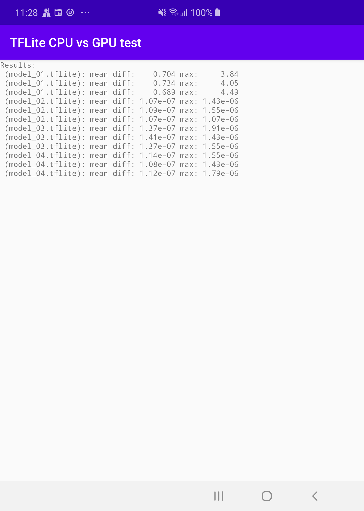

# App. comparing mobile CPU and GPU outputs

App. presents difference in output from given models when run on mobile GPU and CPU.

1. TensorFlow Lite nightly
1. Models with just 1 layer
1. tf.keras.layers.Conv2DTranspose - problematic layer
1. padding 'same'
1. Tensor 'width' is odd

## Models

There are 4 models just to present the problem 2x with same and 2x with odd shape.

| shape / padding | same | valid |
| ----------------|------|-------|
| `(1, 9, 6, 45) odd` |  *0.2* ! | 1e-07 |
| `(1, 10, 6, 45) even` |  1e-07  | 1e-07 |



### Generate models

```
cd tools
python create_models.py
```

### Prepare Python environment
Just install TensorFlow 2.3
```
python -m virtualenv .venv
. .venv/bin/activate
pip install -r requirements.txt
```